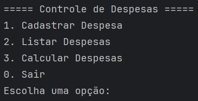

# Controle de Despesas em Java

Este é um programa simples em Java para controlar despesas pessoais. O programa permite que o usuário insira, categorize e calcule suas despesas em três categorias principais:

* **Alimentação:** Registra gastos com restaurantes, lanches, etc.
* **Transporte:** Inclui despesas com gasolina, transporte público, estacionamentos, etc.
* **Diárias:**  Abrange gastos com diárias em viagens, hospedagem, etc.

### Funcionalidades:

* **Cadastro de Despesas:** O usuário pode inserir novas despesas, informando a descrição, categoria e valor.
* **Listagem de Despesas:** O programa lista todas as despesas cadastradas, mostrando a descrição, categoria e valor de cada uma.
* **Cálculo de Despesas:** O programa calcula o total de despesas em cada categoria (alimentação, transporte e diárias) e o total geral.

### Como usar:

1. Compile e execute o arquivo `Principal.java`.
2. Utilize o menu interativo para navegar pelas opções: cadastrar despesas, listar despesas e calcular despesas.
3. Siga as instruções na tela para inserir os dados da despesa.

### Observações:

* O programa utiliza um menu simples no console para interação com o usuário.
* Os dados das despesas são armazenados em memória durante a execução do programa e não são salvos em um arquivo.

Este projeto serve como um exemplo básico de controle de despesas em Java e pode ser expandido com funcionalidades adicionais, como persistência de dados, interface gráfica e relatórios mais detalhados. 

---

## Créditos

Desenvolvido por Mateus S.  
GitHub: [Matz-Turing](https://github.com/Matz-Turing)
